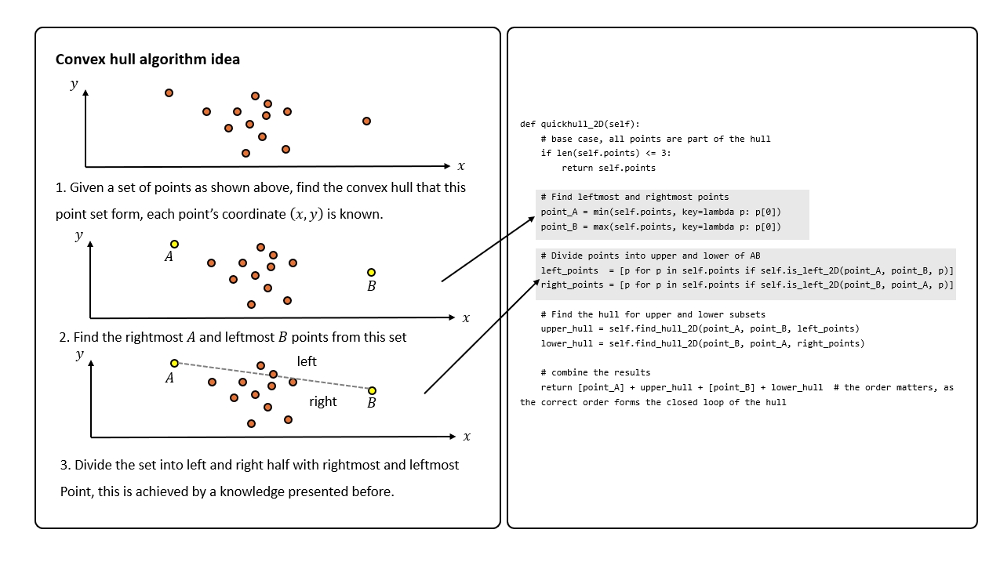

This is my learning process in convex hull algorithm.

Currently only the 2D version is finished. I will soon working on the 3D version.

Some preknowledge of 2D version of the convex hull algorithm:
1. Vector cross product (this helps understand whether a point is located on the upper/left or lower/right side of a line)
2. Recursive algorithm (this helps recursively find new point that is beyond current process)

Also a quick tip in finding `min` points by components in the list: 
Code for reference:
```python
# suppose there is a list of points, each point in (x, y) format:
number = [(3, 2), (8, 1), (10, 6)]
smallest_x_number = min(number, key=lambda p: p[0])
smallest_y_number = min(number, key=lambda p: p[1])

print("The smallest x number is:", smallest_x_number)  # expected output: (3, 2)
print("The smallest y number is:", smallest_y_number)  # expected output: (8, 1)
```
Some key geometry problems in this 2D convex hull:
1. The concept on how to judge if point $C$ is on the upper/left side of line $AB$ or on the right side of line $AB$:

Code for reference:
```python
def is_left_2D(point_A, point_B, p):
        flag = (point_B[0] - point_A[0]) * (p[1] - point_B[1]) - (p[0] - point_B[0]) * (point_B[1] - point_A[1]) > 0
        return flag
```
2. How to find the distance from a point to a line. Here is 2 approaches I have derived to describe this problem (I recommend approach 2 if you are familiar with vector knowledge): 


Code for reference:
```python
def line_equation(point_A, point_B):
    """
    form the line from point A to point B

    return ax + by + c = 0
    """
    slope_k = (point_B[1] - point_A[1]) / (point_B[0] - point_A[0])
    bias_b  = point_A[1] - slope_k * point_A[0]

    a = slope_k
    b = -1
    c = bias_b
    return a, b, c

def find_distance_point_line(self, point_A, point_B, point):
    
    # find k and b of the line formed by point A and point B
    a, b, c = self.line_equation(point_A, point_B)
    
    return abs(a * point[0] + b * point[1] + c) / (a ** 2 + b ** 2) ** 0.5
```
As for 3D convex hull problem, some geometry problems should be known before diving in:
1. How to form a plane equation in 3D with 3 points $P_1$, $P_2$ and $P_3$:

Code for reference:
```python
def plane_equation(p1, p2, p3):
    """
    returns the plane equation's coefficients with given points p1, p2, p3
    p1: (x1, y1, z1)
    p2: (x2, y2, z2)
    p3: (x3, y3, z3)

    return a, b, c, d where ax + by + cz = d
    """
    p1_p2 = [p2[i] - p1[i] for i in range(len(p1))]
    p1_p3 = [p3[i] - p1[i] for i in range(len(p1))]

    normal = np.cross(p1_p2, p1_p3)
    a, b, c = normal
    d = a * p1[0] + b * p1[1] + c * p1[2]
    return a, b, c, d
```

2. How to find the distance from a point to a plane:

Code for reference:
```python
def perpendicular_dist(face, point: list):
    """
    returns the perpendicular distance from the point to the face
    face: list of 3 points: [(x1, y1, z1), (x2, y2, z2), (x3, y3, z3)]
    point: (x, y, z) of a point not on the face

    return the distance from the point to the face
    """

    a, b, c, d = plane_equation(face)
    x, y, z = point
    return abs(a * x + b * y + c * z - d) / (a ** 2 + b ** 2 + c ** 2) ** 0.5
```

3. How to judge if a point is outside the plane and it is on the same side as the plane's normal vector:


Code for reference:
```python
def is_point_outside(face, point, epsilon=1e-6):
    """
    check if the point is outside the face
    face:  list of 3 points: [(x1, y1, z1), (x2, y2, z2), (x3, y3, z3)]
    point: (x, y, z) of a point

    check if ax + by + cz > d, return True if it is
    """
    a, b, c, d = plane_equation(face)
    x, y, z = point
    return a * x + b * y + c * z - d > epsilon
```

Then here comes the overall idea of convex hull algorithm of 2D:

1. Find the rightmost and leftmost point $A$ and point $B$. Divide the points into left and right half based on line $AB$.

2. For each half of the points, find its hull.

3. Details on how to find its hull: left hull case.

4. Details on how to find its hull: right hull case.

5. Combine the left hull and right hull.


Here comes the overall idea of convex hull algorithm of 3D:
1. Find all extreme points `min_x`, `max_x`, `min_y`, `max_y`, `min_z` and `max_z`. Create tetrahedron out of 4 non-coplanar points from those extreme points.

2. Create faces based on this tetrahedron $P_{1}P_{2}P_{3}P_{4}$.

3. Find points that are outside of each face. 

4. Find the farthest point from these outside points.

5. Find the edges of each face.

6. Extend hull faces.
